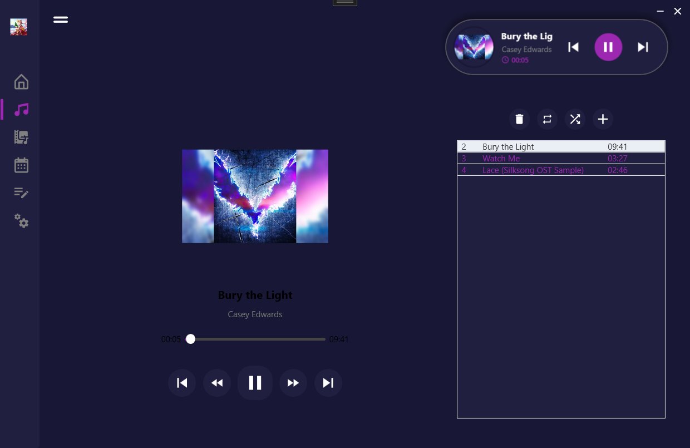

# 🎵 Rika Desktop Assistant


**Rika Desktop Assistant** is a modern, all-in-one productivity and media management tool developed using **C# WPF** and **MVVM Architecture**. Designed to declutter the desktop experience, it combines a professional music player, to-do list, and calendar into a single, elegant interface powered by **Material Design**.

---

## 📸 Screenshots

| Music Player | Dashboard|
|:-------------------------:|:------------------:|
|  |  |

---

## 🚀 Key Features

### 🎧 Advanced Music Player
- **Powered by NAudio:** Replaced standard `MediaElement` with **NAudio** engine for low-latency audio processing and wider format support.
- **Immersive UI:** Dynamic background that adapts to the **Album Art** with a blur effect (Glassmorphism).
- **Playlist Management:** Create, save, and manage playlists (JSON-based persistence).
- **Smart Controls:** Shuffle, Loop, Next/Prev, and specific seeking capabilities.

### 📅 Productivity Tools
- **To-Do List:** Add, remove, and track daily tasks.
- **Calendar:** Integrated view to manage dates and events.
- **Settings:** Customizable user preferences.

### 💻 System Integration
- **Desktop Widget:** A floating, draggable mini-player widget for quick access.
- **System Tray Icon:** Minimized background operation with a context menu for quick controls (Play, Pause, Next).

---

## 🛠️ Tech Stack & Architecture

This project strictly follows the **MVVM (Model-View-ViewModel)** design pattern to ensure separation of concerns, testability, and maintainability.

- **Language:** C#
- **Framework:** .NET 8.0 (WPF)
- **UI Library:** [MaterialDesignInXamlToolkit](http://materialdesigninxaml.net/)
- **Audio Engine:** [NAudio](https://github.com/naudio/NAudio)
- **Data Persistence:** System.Text.Json
- **Metadata Handling:** TagLib-Sharp (For reading MP3 tags/Album Art)


### Architecture Overview


## 📦 Getting Started

To get a local copy up and running, follow these simple steps.

### Prerequisites

Before you begin, ensure you have the following installed:
* **Visual Studio 2022** (with ".NET Desktop Development" workload installed).
* **.NET 6.0 SDK** (or .NET 8.0, depending on your project target).
* **Git** (to clone the repository).

---

## 💿 Installation & Running

You can run the application in two ways: by opening the source code in Visual Studio or by running the executable file directly.

### Method 1: Building from Source (For Developers)
This method is recommended if you want to inspect the code or make changes.

1. **Clone the repository:**
   ```bash
   git clone https://github.com/Mikleo18/MyDesktopAssitant.git
   ```
2. **Open the project:** Navigate to the project folder and open MyDeskopAssitant.sln with Visual Studio 2022.
3. **Restore Packages:** Visual Studio should automatically restore NuGet packages (NAudio, MaterialDesign, etc.). If not, go to Tools > NuGet Package Manager > Package Manager Console and run:
   ```bash
   dotnet restore
   ```
4.**Run:** F5 or click the start button.


### Method 2: Running the Executable (Quick Run)
If you just want to use the application without opening Visual Studio:

1. **Navigate to the Output Directory:** After cloning (or downloading the project zip), go to the following folder path: MyDeskopAssitant > bin > Debug (or Release) > net6.0-windows

2. **Launch the App:** Find and double-click the MyDeskopAssitant.exe file.

3. **Enjoy:** The application will start immediately. (Note: Ensure all .dll files in that folder are present, as they are required dependencies.)

## ⚙️ Configuration (API Key Setup)

This project uses **OpenWeatherMap** to fetch real-time weather data. For security reasons, the API Key is **not included** in the source code. You must add your own key for the weather feature to work.

### Step 1: Get a Free API Key
1. Go to [OpenWeatherMap](https://openweathermap.org/) and sign up.
2. Generate a free API Key from your account dashboard.

### Step 2: Create the Config File
1. In Visual Studio, right-click on the project name in **Solution Explorer**.
2. Select **Add > New Item...** and create a file named `appsettings.json`.
3. Paste the following code into the file and replace `PASTE_YOUR_KEY_HERE` with your actual API key:

```json
{
  "OpenWeatherMap": {
    "ApiKey": "PASTE_YOUR_KEY_HERE"
  }
}
```

## 📄 License & Disclaimer

This project is intended for **educational purposes only** .

### Disclaimer
This software is provided "as is", without warranty of any kind. It is designed to demonstrate technical proficiency in **C# WPF** and **Software Architecture** concepts. The external libraries used (NAudio, MaterialDesignInXamlToolkit, TagLib-Sharp) belong to their respective owners and are used in accordance with their licenses.
